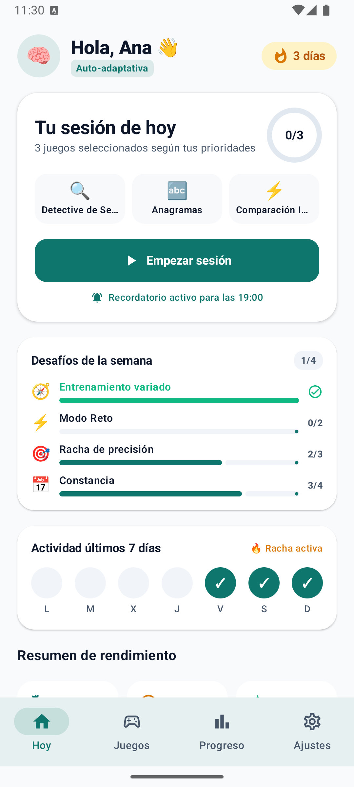
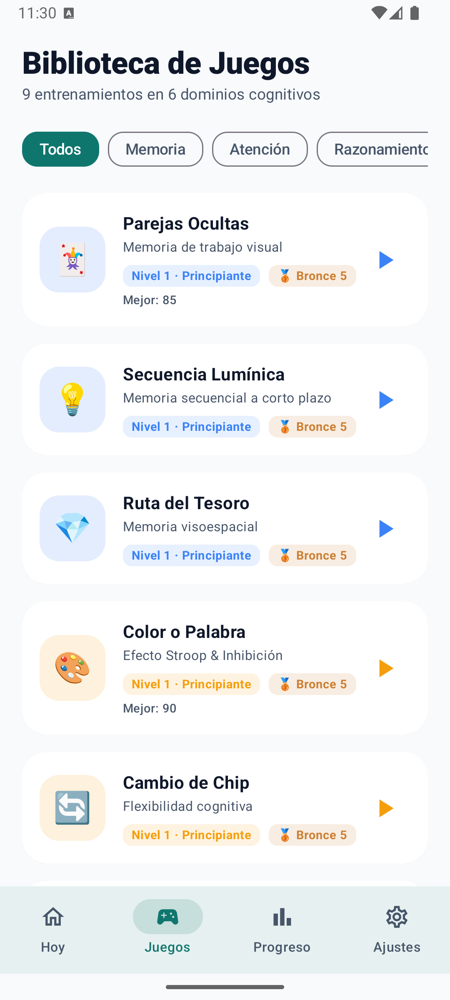
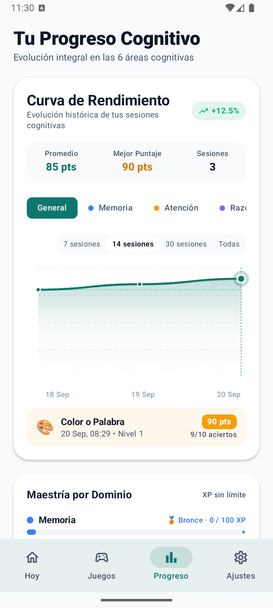
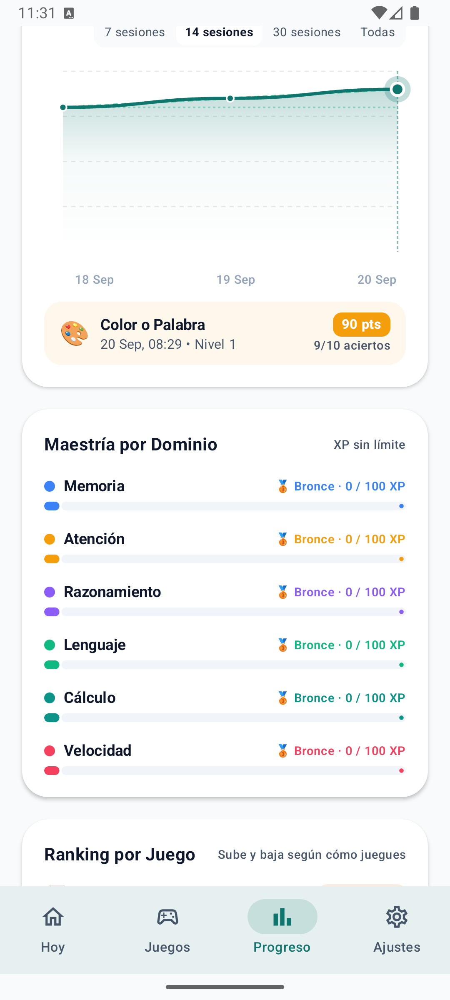
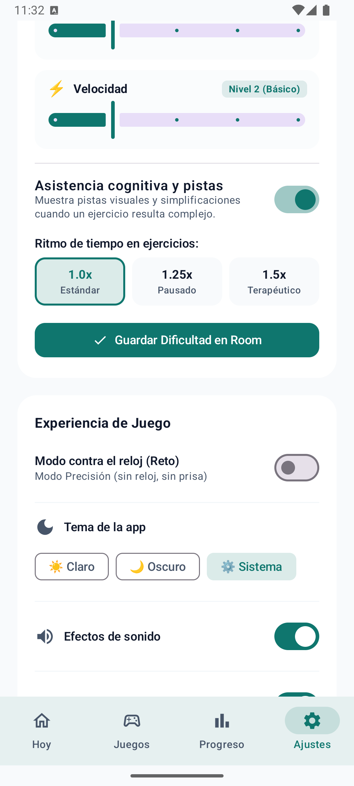
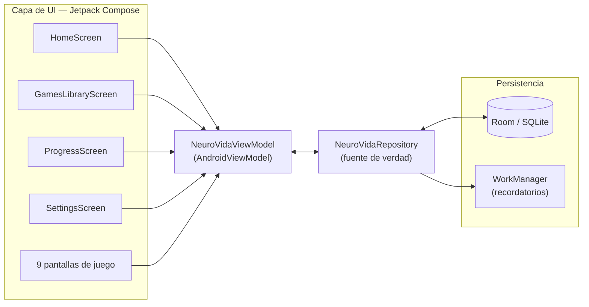
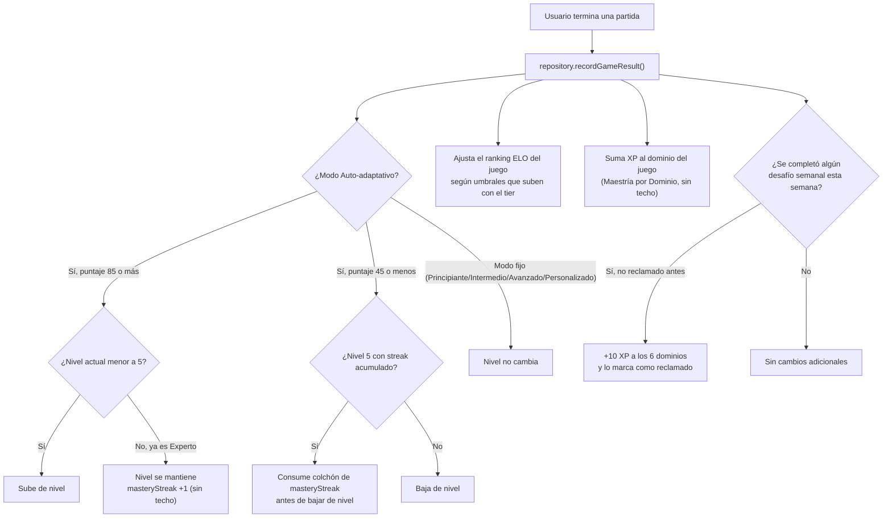
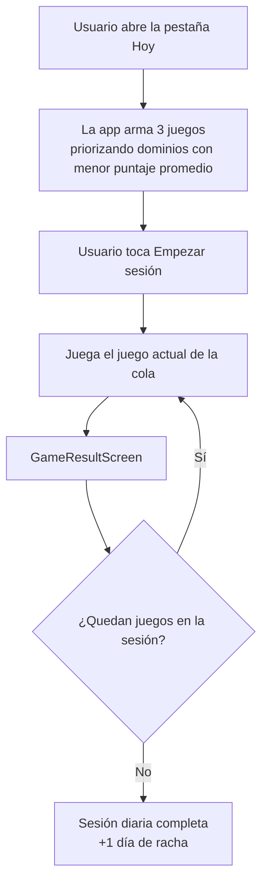
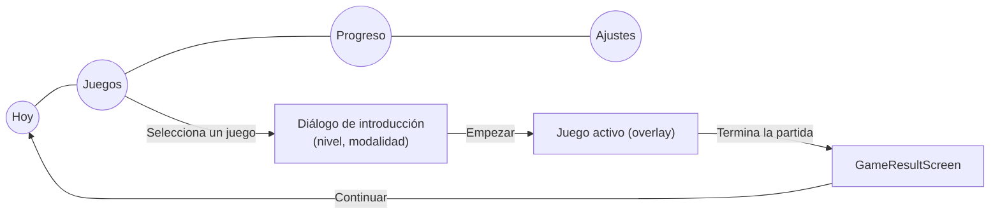
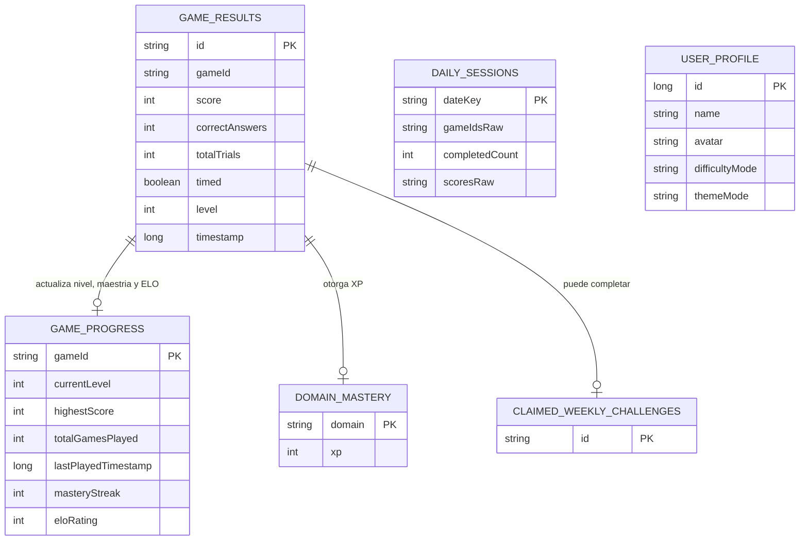

<div align="center">


# 🧠 NeuroVida

**Estimulación cognitiva diaria, basada en evidencia, en 9 juegos y 6 dominios.**

App nativa Android para entrenar memoria, atención, razonamiento, lenguaje, cálculo y velocidad
de procesamiento, con dificultad adaptativa sin techo, ranking competitivo por juego y
seguimiento real de progreso.

[](https://kotlinlang.org)
[](https://developer.android.com/jetpack/compose)
[](https://developer.android.com/training/data-storage/room)
[](#-stack-tecnológico)
[](#-roadmap)

</div>

---

## Índice

- [Descripción general](#-descripción-general)
- [Capturas de pantalla](#-capturas-de-pantalla)
- [Características principales](#-características-principales)
- [Los 9 juegos](#-los-9-juegos)
- [Arquitectura](#-arquitectura)
- [Flujos de funcionamiento](#-flujos-de-funcionamiento)
- [Modelo de datos](#-modelo-de-datos-room)
- [Stack tecnológico](#-stack-tecnológico)
- [Estructura del proyecto](#-estructura-del-proyecto)
- [Cómo compilar y ejecutar](#-cómo-compilar-y-ejecutar)
- [Roadmap](#-roadmap)

---

## 📋 Descripción general

**NeuroVida** es una aplicación Android nativa (Kotlin + Jetpack Compose) de estimulación
cognitiva. Cada día propone una sesión corta de 3 juegos elegidos según los dominios donde el
usuario más lo necesita, y todo el progreso —niveles, rachas, rankings, maestría por dominio y
desafíos semanales— se persiste localmente con Room, sin necesidad de cuenta ni conexión a
internet.

El proyecto nació como export de Google AI Studio y evolucionó agregando una capa completa de
gamificación real (no cosmética): dificultad que nunca deja de crecer, un sistema de ranking tipo
ELO por juego, metas semanales fijas y un modelo de datos íntegramente reactivo con `StateFlow`.

## 📸 Capturas de pantalla

<table>
<tr>
<td align="center" width="33%">
<br/>
<b>Hoy</b> — sesión diaria y desafíos semanales
</td>
<td align="center" width="33%">
<br/>
<b>Juegos</b> — nivel y ranking por juego
</td>
<td align="center" width="33%">
<br/>
<b>Progreso</b> — curva de rendimiento
</td>
</tr>
<tr>
<td align="center" width="33%">
<br/>
<b>Progreso</b> — maestría por dominio y ranking ELO
</td>
<td align="center" width="33%">
<br/>
<b>Ajustes</b> — dificultad y tema
</td>
<td width="33%"></td>
</tr>
</table>

## ✨ Características principales

### Entrenamiento
- **9 juegos en 6 dominios cognitivos** — memoria, atención, razonamiento, lenguaje, cálculo y
  velocidad de procesamiento.
- **Sesión diaria inteligente** — cada día arma 3 juegos priorizando los dominios con menor
  puntaje promedio, para entrenar parejo.
- **Modo Precisión vs. Modo Reto** — sin reloj para practicar con calma, o contra el tiempo para
  mayor exigencia.
- **Asistencia cognitiva configurable** — pistas visuales y ritmo de tiempo ajustable (1.0x /
  1.25x / 1.5x) para distintos niveles de necesidad.

### Dificultad y progreso — sin techo real
- **Dificultad adaptativa** — el nivel (1 a 5) sube o baja solo según el desempeño de cada sesión.
- **Maestría sin techo (`masteryStreak`)** — al llegar a nivel máximo, seguir rindiendo bien sigue
  endureciendo el juego (tiempos, rangos numéricos, distractores) indefinidamente.
- **DDA en vivo** — en varios juegos, encadenar aciertos *dentro de la misma partida* ya la
  endurece, sin esperar a la siguiente sesión.
- **Ranking ELO por juego** — cada uno de los 9 juegos tiene su propio rango (Bronce → Plata → Oro
  → Platino → Diamante → Maestro, con 5 divisiones) que **sube y baja** con cada partida, distinto
  de la maestría por dominio, que solo crece.
- **Maestría por Dominio** — XP acumulada sin límite por dominio cognitivo, ganada con cualquier
  partida de ese dominio, aunque el juego individual ya esté al máximo nivel.
- **Desafíos semanales fijos** — 4 metas deterministas (variedad de dominios, modo Reto,
  precisión, constancia) calculadas en vivo desde el historial real, no contadores aparte.

### Seguimiento y hábito
- **Curva de rendimiento** con filtros por dominio y por rango de sesiones (7 / 14 / 30 / todas).
- **Rachas diarias** y actividad de los últimos 7 días.
- **Recordatorios diarios** programados con `WorkManager`, a la hora que el usuario elija.
- **Perfiles múltiples** (varios usuarios en el mismo dispositivo).

### Personalización
- **Tema Claro / Oscuro / Sistema**, aplicado en vivo y persistido.
- **Dificultad personalizada por dominio** (modo "Por Dominio": nivel 1-5 independiente para cada
  una de las 6 áreas).

## 🎮 Los 9 juegos

| Juego | Dominio | Qué entrena |
|---|---|---|
| 🃏 Parejas Ocultas | Memoria | Memoria de trabajo visual |
| 💡 Secuencia Lumínica | Memoria | Memoria secuencial a corto plazo |
| 💎 Ruta del Tesoro | Memoria | Memoria visoespacial |
| 🎨 Color o Palabra | Atención | Efecto Stroop e inhibición |
| 🔄 Cambio de Chip | Atención | Flexibilidad cognitiva |
| 🔍 Detective de Series | Razonamiento | Lógica inductiva y patrones |
| 🔤 Anagramas | Lenguaje | Léxico y procesamiento fonológico |
| 🧮 Cálculo Sereno | Cálculo | Aritmética mental |
| ⚡ Comparación Instantánea | Velocidad | Velocidad perceptiva |

## 🏗️ Arquitectura

MVVM clásico sobre Compose, con un único repositorio como fuente de verdad y todo el estado
expuesto como `StateFlow` reactivo desde Room.



Todas las pantallas leen `StateFlow` expuestos por el ViewModel (`gameHistory`, `gameLevels`,
`gameIntensity`, `gameRanks`, `domainMasteryInfo`, `weeklyChallengeProgress`, `userSettings`, …);
ninguna pantalla consulta Room directamente.

## 🔄 Flujos de funcionamiento

### 1. Qué pasa al terminar una partida

Este es el corazón del sistema de progreso: una sola partida puede mover hasta cuatro cosas a la
vez (nivel, maestría, ranking ELO y XP de dominio), además de poder completar un desafío semanal.



### 2. Sesión diaria



### 3. Navegación general



## 🗄️ Modelo de datos (Room)



Todas las tablas viven en una única base `neurovida_database`, sin backend: el progreso es 100%
local al dispositivo.

## 🛠️ Stack tecnológico

| Categoría | Tecnología |
|---|---|
| Lenguaje | Kotlin 2.2.10 |
| UI | Jetpack Compose (BOM 2024.09.00) + Material 3 |
| Arquitectura | MVVM — `ViewModel` + `StateFlow`/`Flow` |
| Persistencia | Room 2.7.0 (SQLite) |
| Tareas en segundo plano | WorkManager 2.9.1 (recordatorios diarios) |
| Imágenes | Coil 2.7.0 |
| Networking (reservado) | Retrofit + Moshi + OkHttp |
| Backend opcional | Firebase (AI, Firestore, Auth, App Check) — no activo por defecto |
| Testing | JUnit4, Espresso, Robolectric, Roborazzi (screenshot testing) |
| Build | Gradle 9.3.1 · Android Gradle Plugin 9.1.1 · KSP |
| Compatibilidad | `minSdk` 24 (Android 7.0) · `targetSdk`/`compileSdk` 36 |

## 📁 Estructura del proyecto

```
app/src/main/java/com/example/
├── MainActivity.kt              # Entry point, bottom nav, overlays de juego/resultado
├── model/
│   └── Models.kt                 # DomainType, GameRegistry, RankTier, MasteryTier,
│                                  # WeeklyChallenge*, UserSettings, ThemeMode…
├── data/
│   ├── NeuroVidaRepository.kt    # Fuente de verdad: StateFlows + lógica de progreso
│   └── local/
│       ├── Entities.kt           # Entidades Room
│       ├── Daos.kt               # DAOs
│       └── NeuroVidaDatabase.kt  # @Database
├── viewmodel/
│   └── NeuroVidaViewModel.kt     # Expone estado a la UI, orquesta acciones
├── games/                        # Un archivo por juego + GameResultScreen
│   ├── ParejasGame.kt · SecuenciaGame.kt · RutaTesoroGame.kt
│   ├── StroopGame.kt · CambioChipGame.kt · SeriesGame.kt
│   ├── AnagramasGame.kt · CalculoGame.kt · ComparacionGame.kt
│   └── GameResultScreen.kt
├── ui/
│   ├── screens/                  # HomeScreen, GamesLibraryScreen, ProgressScreen, SettingsScreen
│   ├── components/                # ProgressTrendChart, CommonUi
│   └── theme/                     # Color, Theme (claro/oscuro), Type
└── notification/
    └── CognitiveReminderWorker.kt # Recordatorio diario vía WorkManager
```

## 🚀 Cómo compilar y ejecutar

**Requisitos:**
- Android Studio (Ladybug o superior) o el wrapper de Gradle incluido.
- JDK 21.
- Android SDK con `platform-36` y `build-tools 36.0.0`.

**Pasos:**

```bash
git clone https://github.com/ricardohernandezpsico-coder/APP-de-estimulacion-cognitiva.git
cd APP-de-estimulacion-cognitiva
```

1. Abrí el proyecto en Android Studio y dejá que sincronice Gradle, **o** compilá por línea de
   comandos con el wrapper incluido:
   ```bash
   ./gradlew assembleDebug
   ```
2. Si compilás fuera de Android Studio, vas a necesitar generar un `debug.keystore` propio del
   proyecto (el `signingConfig` de debug no usa el keystore global de Android):
   ```bash
   keytool -genkey -v -keystore debug.keystore -storepass android -alias androiddebugkey \
     -keypass android -keyalg RSA -keysize 2048 -validity 10000 -dname "CN=Android Debug,O=Android,C=US"
   ```
3. El APK queda en `app/build/outputs/apk/debug/app-debug.apk`.

> Firebase está en las dependencias (`firebase-ai`, App Check) pero mayormente comentado — falta
> `google-services.json` y el build solo advierte, no falla, mientras no se use de verdad.

## 🗺️ Roadmap

- [ ] Extender el patrón de DDA en vivo a los 6 juegos que todavía no lo tienen.
- [ ] Extender el bono de tiempo de reacción → puntaje al resto de los juegos (hoy solo en
      Secuencia Lumínica y Comparación Instantánea).
- [ ] Colección de avatares/skins desbloqueables por Maestría (hoy los 7 avatares son de libre
      elección).
- [ ] Recompensa variable de baja frecuencia (bonos aleatorios).
- [ ] Indicador de "cuánto falta para que termine la semana" en los desafíos semanales.
- [ ] Build de release firmado para publicación en Play Store.

---

<div align="center">
<sub>Proyecto personal en desarrollo activo. Sin licencia de código abierto por el momento.</sub>
</div>
